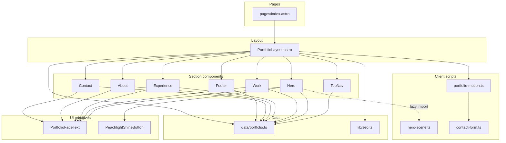
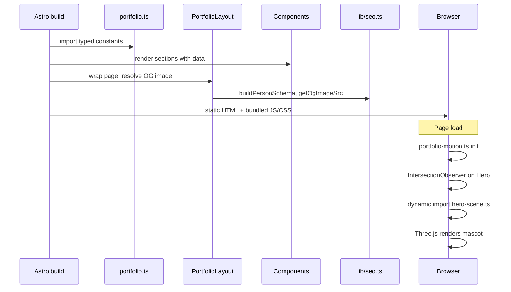
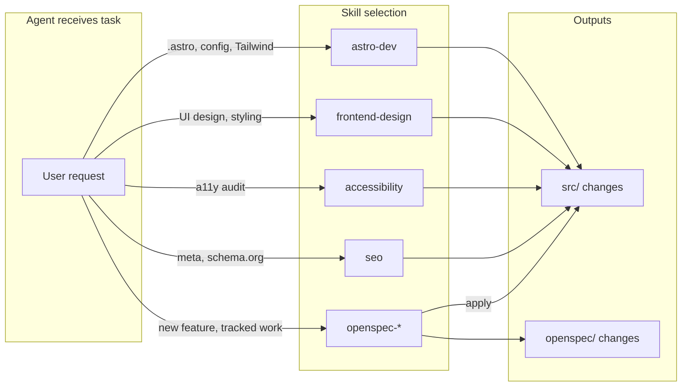
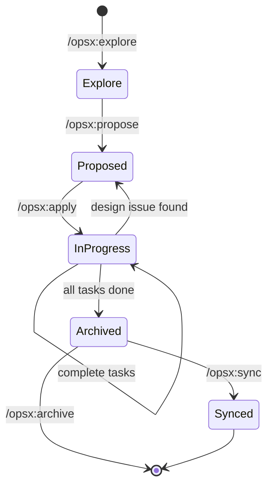
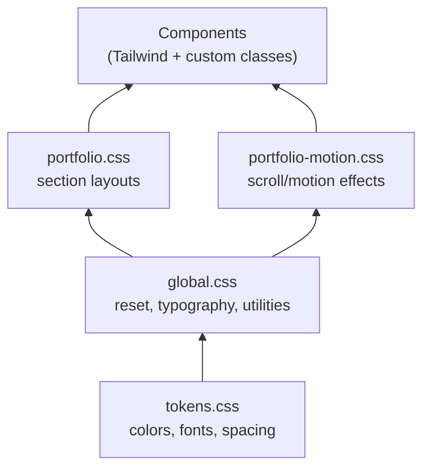

# AGENTS.md

Guide for AI agents working on **personal-web-app** — José Luis Jiménez's Peachlight portfolio built with Astro 7, Tailwind CSS v4, and Three.js.

---

## Project overview

| Aspect | Detail |
|--------|--------|
| **Stack** | Astro 7, Tailwind CSS v4 (`@tailwindcss/vite`), Three.js, TypeScript |
| **Deploy target** | GitHub Pages (`PUBLIC_SITE_URL` + `PUBLIC_BASE_PATH` in `astro.config.mjs`) |
| **Content model** | Typed constants in `src/data/portfolio.ts` (YAML content collections planned via OpenSpec) |
| **Testing** | Vitest unit tests (`src/**/*.test.ts`, `vitest.config.ts`) + Playwright E2E (`tests/`, `.github/workflows/playwright.yml`, `.github/workflows/vitest.yml`) |
| **Spec workflow** | OpenSpec (`openspec/`, spec-driven schema) |

---

## Repository structure

```text
personal-web-app/
├── AGENTS.md                 # This file — agent onboarding & architecture
├── astro.config.mjs          # Site URL, base path, sitemap, Tailwind Vite plugin
├── package.json              # Scripts and dependencies
├── vitest.config.ts          # Unit test runner (Astro getViteConfig)
├── playwright.config.ts      # E2E test runner config
│
├── .agents/skills/           # Domain skills (source of truth)
├── .claude/
│   ├── commands/opsx/        # Slash commands: propose, apply, archive, explore, sync
│   └── skills/               # Symlinks to .agents/skills + OpenSpec workflow skills
│
├── openspec/
│   ├── config.yaml           # OpenSpec schema (spec-driven)
│   └── changes/              # Active & archived change proposals
│
├── public/                   # Static assets served as-is
│   ├── favicon.svg
│   ├── robots.txt
│   ├── models/               # GLB 3D mascot
│   └── draco/gltf/           # Draco decoder for compressed GLTF
│
├── src/
│   ├── assets/               # Images processed by Astro (e.g. portrait for OG)
│   ├── components/           # Section & UI Astro components
│   ├── data/                 # Typed portfolio content
│   ├── layouts/              # Page shell (HTML head, SEO, global scripts)
│   ├── lib/                  # Shared utilities (SEO helpers)
│   ├── pages/                # File-based routes
│   ├── scripts/              # Client-side TypeScript (motion, 3D, forms)
│   └── styles/               # Design tokens & global CSS
│
└── tests/                    # Playwright specs
```

---

## Application architecture

### Layer responsibilities

| Layer | Path | Responsibility |
|-------|------|----------------|
| **Pages** | `src/pages/` | Compose sections into a route. `index.astro` is the single-page portfolio. |
| **Layout** | `src/layouts/PortfolioLayout.astro` | HTML document shell: meta/OG tags, JSON-LD, fonts, skip link, scroll progress, loads `portfolio-motion.ts`. |
| **Components** | `src/components/` | Presentational sections and reusable UI primitives. Read data from `src/data/portfolio.ts`. |
| **Data** | `src/data/portfolio.ts` | Single source of truth for copy, nav, projects, experience, and contact info. Export typed constants. |
| **Lib** | `src/lib/` | Build-time helpers (e.g. `seo.ts` — OG image optimization, Person/WebSite schema). |
| **Scripts** | `src/scripts/` | Client-only behavior loaded via `<script>` tags or dynamic `import()`. |
| **Styles** | `src/styles/` | Peachlight design system: `tokens.css` → `global.css` → `portfolio.css` / `portfolio-motion.css`. |
| **Public** | `public/` | Unprocessed static files (3D model, Draco WASM, favicon, robots). |

### Component map

| Component | Role |
|-----------|------|
| `TopNav.astro` | Fixed navigation, section links, mobile menu, CTA. |
| `Hero.astro` | Landing section: headline, CTAs, ambient visuals, lazy-loaded Three.js mascot (`hero-scene.ts`). |
| `Work.astro` | Selected projects grid with inline SVG thumbnails. |
| `Experience.astro` | Career timeline (timeline + compact entry types). |
| `About.astro` | Bio, skills, portrait. |
| `Contact.astro` | Contact form (validated client-side via `contact-form.ts`). |
| `Footer.astro` | Site footer with social links. |
| `PortfolioFadeText.astro` | Reusable scroll-reveal text wrapper (`data-od-id` hooks for motion). |
| `PeachlightShineButton.astro` | Primary CTA with shine hover effect. |

### Client scripts

| Script | Loaded by | Responsibility |
|--------|-----------|----------------|
| `portfolio-motion.ts` | `PortfolioLayout` (global) | Scroll progress, active nav highlighting, section handoff effects, imports `contact-form.ts`. |
| `hero-scene.ts` | `Hero` (lazy, IntersectionObserver) | Three.js scene: GLTF mascot, particle forest, OrbitControls, Draco decoding. |
| `contact-form.ts` | `portfolio-motion.ts` | Client-side validation and success state for the contact form. |

### Data flow

Content flows **down** from `portfolio.ts` into components at build time. Client scripts attach to DOM via `data-od-id` attributes and section `id`s — they never import portfolio data directly.

---

## Agent skills & workflows

Skills live in `.agents/skills/` and are exposed to Claude via symlinks in `.claude/skills/`. **Read the relevant `SKILL.md` before working in that domain.**

### Domain skills (`.agents/skills/`)

| Skill | Use when |
|-------|----------|
| **astro-dev** | Editing `.astro` files, `astro.config.*`, Tailwind v4, hydration, content collections, view transitions. Primary skill for this repo. |
| **astro** | General Astro framework questions, CLI, project structure. |
| **frontend-design** | Building or restyling UI with intentional Peachlight aesthetics. |
| **accessibility** | WCAG audits, keyboard nav, screen reader support, skip links, ARIA. |
| **seo** | Meta tags, structured data, sitemap, canonical URLs, OG images. |
| **typescript-advanced-types** | Complex TypeScript types for data models. |
| **nodejs-best-practices** | Node.js runtime patterns (limited use in static Astro site). |
| **nodejs-backend-patterns** | Backend/API patterns (future server features). |

### OpenSpec workflow skills (`.claude/skills/`)

| Skill / Command | Role |
|-----------------|------|
| **openspec-explore** / `/opsx:explore` | Research and explore before proposing a change. |
| **openspec-propose** / `/opsx:propose` | Create a new change with proposal, specs, design, and tasks. |
| **openspec-apply-change** / `/opsx:apply` | Implement pending tasks from a change's `tasks.md`. |
| **openspec-archive-change** / `/opsx:archive` | Archive a completed change to `openspec/changes/archive/`. |
| **openspec-sync-specs** / `/opsx:sync` | Sync implemented specs back to `openspec/specs/`. |

OpenSpec uses the **spec-driven** schema (`openspec/config.yaml`). Each change under `openspec/changes/<name>/` contains:

- `proposal.md` — motivation and scope
- `design.md` — technical decisions
- `specs/` — capability specs
- `tasks.md` — checkbox implementation checklist

Archived changes (phase 1, phase 2, CSS/Tailwind refactors) live in `openspec/changes/archive/`.

---

## Development

When starting the dev server, use background mode:

```sh
astro dev --background
```

Manage the background server with `astro dev stop`, `astro dev status`, and `astro dev logs`.

### Common commands

| Command | Action |
|---------|--------|
| `pnpm dev` | Start dev server |
| `pnpm build` | Production build → `dist/` |
| `pnpm preview` | Preview production build |
| `pnpm test:unit` | Run Vitest unit tests |
| `pnpm test:unit:watch` | Run Vitest in watch mode |
| `pnpm test:e2e` | Run Playwright E2E tests |
| `pnpm test` | Run unit tests, then E2E tests |

### Environment variables

| Variable | Default | Purpose |
|----------|---------|---------|
| `PUBLIC_SITE_URL` | `https://j-luis-dev.github.io` | Canonical site origin |
| `PUBLIC_BASE_PATH` | `/personal-web-app` | GitHub Pages subpath |

### Conventions for agents

1. **Content changes** → edit `src/data/portfolio.ts` (or future YAML collections per OpenSpec).
2. **Visual/section changes** → edit the matching component in `src/components/`.
3. **SEO/meta** → `PortfolioLayout.astro` + `src/lib/seo.ts`.
4. **Motion/scroll** → `portfolio-motion.ts` + `portfolio-motion.css`; use `data-od-id` for hooks.
5. **3D hero** → `hero-scene.ts` + `public/models/`; keep lazy-load pattern in `Hero.astro`.
6. **New features** → prefer OpenSpec propose → apply workflow for tracked changes.

---

## Architecture diagrams

### High-level component composition



### Build-time vs runtime



### Agent skill routing



### OpenSpec change lifecycle



### Style system layering



---

## Documentation

Full Astro documentation: https://docs.astro.build

Consult these guides before working on related tasks:

- [Adding pages, dynamic routes, or middleware](https://docs.astro.build/en/guides/routing/)
- [Working with Astro components](https://docs.astro.build/en/basics/astro-components/)
- [Using React, Vue, Svelte, or other framework components](https://docs.astro.build/en/guides/framework-components/)
- [Adding or managing content](https://docs.astro.build/en/guides/content-collections/)
- [Adding styles or using Tailwind](https://docs.astro.build/en/guides/styling/)
- [Supporting multiple languages](https://docs.astro.build/en/guides/internationalization/)
